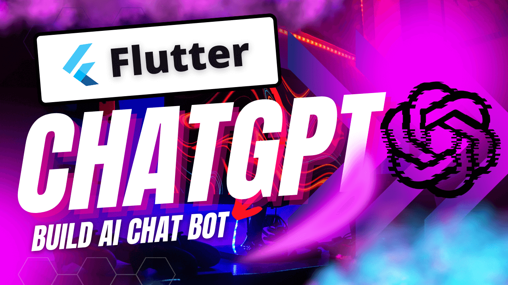

# ChatGPT-Flutter

A Chatbot chat app built using the Flutter framework and OpenAI's GPT-3 language model.

### Show some :heart: and star the repo.

## Features

- Natural language understanding
- Human-like conversation
- Customizable to fit your use-case
- Lightweight, easy to integrate with other apps
- Open-source

## Prerequisites

- Flutter SDK
- Used Bloc for state management 
- API key for OpenAI GPT-3 [Available here](https://beta.openai.com/account/api-keys)

## Getting Started

1. Clone the repository
2. Run `flutter pub get` to install dependencies
3. Replace the placeholder API key with your own in the `chat_screen.dart` file
4. Run the app on an emulator or physical device

The chatbot can be further customized to fit your use-case by modifying the code in the `main.dart` file and other files. The source code for the chatbot is available on GitHub.

### Development by

- OpenAI - https://openai.com
- Flutter - https://flutter.dev/

Please open an issues on the repository if you find any bugs or if you would like to contribute.

Code and documentation Copyright 2023 [Karan Singla](https://www.linkedin.com/in/karansingla007/).

https://user-images.githubusercontent.com/26064126/217953251-8dcdd8ab-3a71-4ff5-a056-f925f6583b1b.mp4
